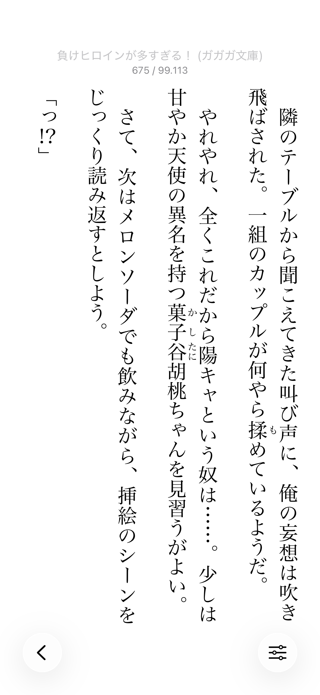
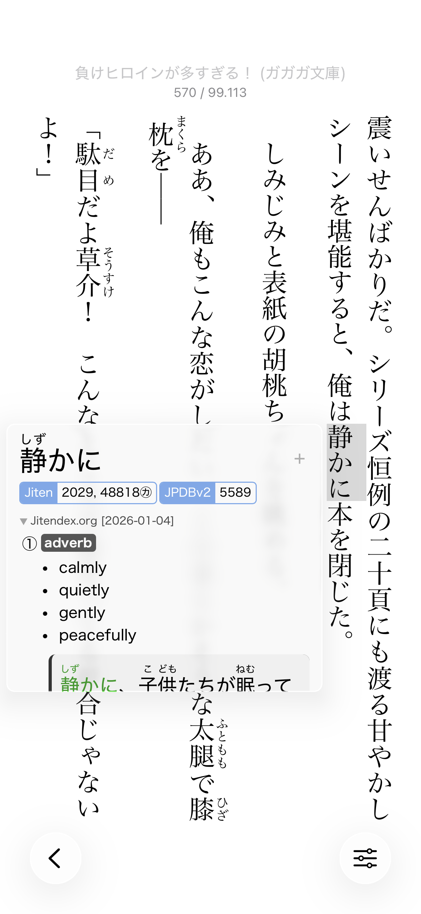
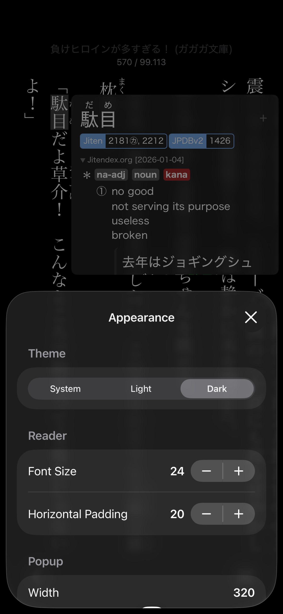
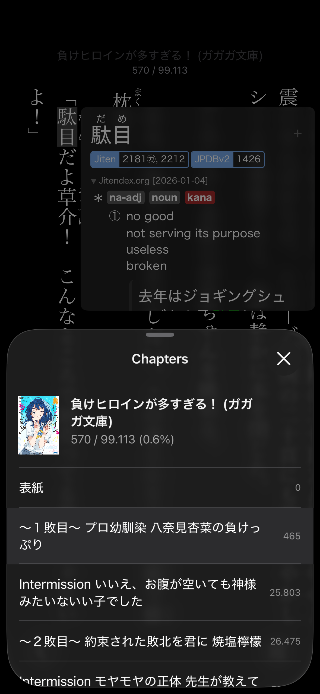
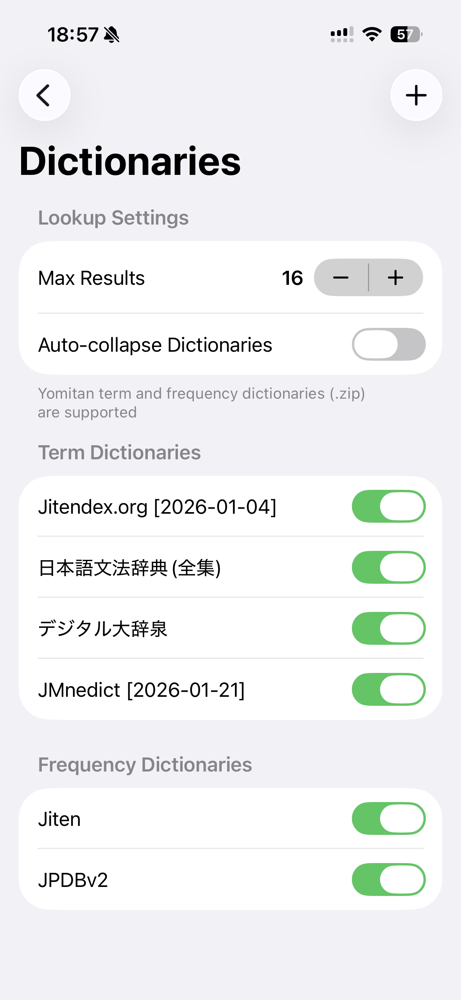

# Hoshi Reader

A lightweight Japanese EPUB reader designed for iOS 26 with Yomitan dictionary support

    
    
    
    
    
    

## Download

## Features

- Vertical text (縦書き)
- Reimplementation of a Yomitan-like popup dictionary with deinflection support
- Full support for Yomitan term and frequency dictionaries
- Anki integration, one click mining
- Mining handlebars that conform to Yomitan's format

## Development

1. Clone the repository.
2. Open `HoshiReader.xcodeproj` in Xcode.

## Libraries

| Name | Description | License |
| :--- | :--- | :--- |
| [yomitandicts-cpp](https://github.com/Manhhao/yomitandicts-cpp) | Dictionary backend | GPLv3 |
| [EPUBKit](https://github.com/witekbobrowski/EPUBKit) | EPUB parsing library | MIT |

## Issues

Please open an issue [here](https://github.com/Manhhao/Hoshi-Reader/issues) or in the TMW thread.

## Special Thanks

* **[TheMoeWay](https://learnjapanese.moe/)** - Enabling me to start learning real Japanese through immersion.
* **[Yomitan](https://github.com/yomidevs/yomitan)** - For serving as an invaluable tool and the primary inspiration for the pop-up dictionary.
* **[ッツ Ebook Reader](https://github.com/ttu-ttu/ebook-reader)** - Inspiring the core reading experience.
* **[星街すいせい (Hoshimachi Suisei)](https://www.youtube.com/@HoshimachiSuisei)** - For being my motivation behind learning Japanese and giving the project a name (星読み).

## License

Distributed under the GNU General Public License v3.0. See [LICENSE](LICENSE) for more information.
